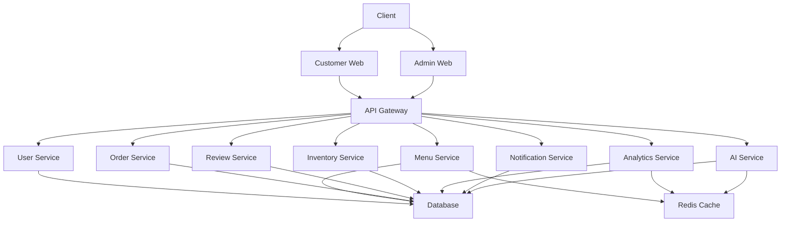
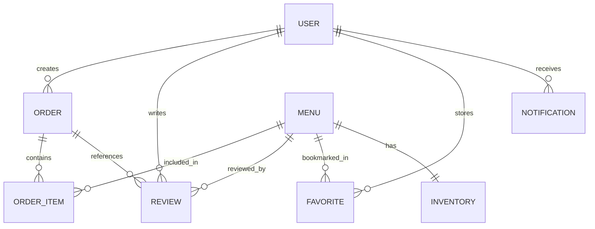
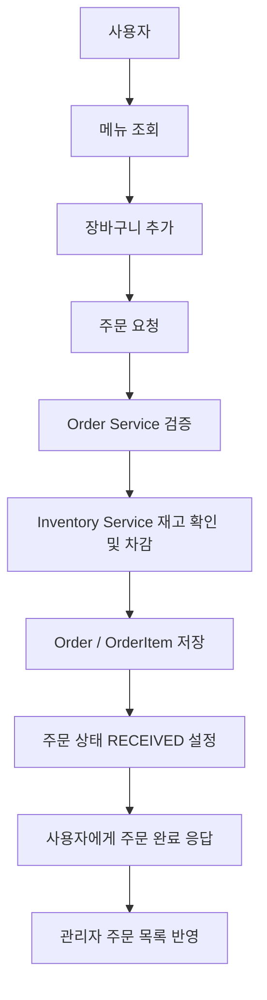
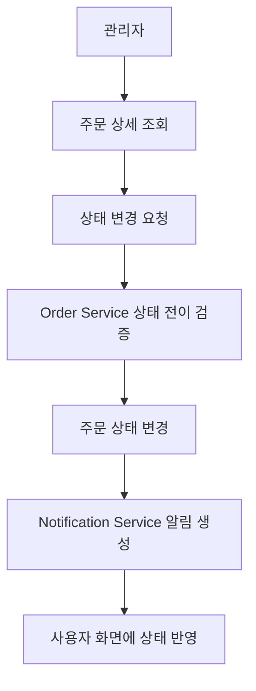
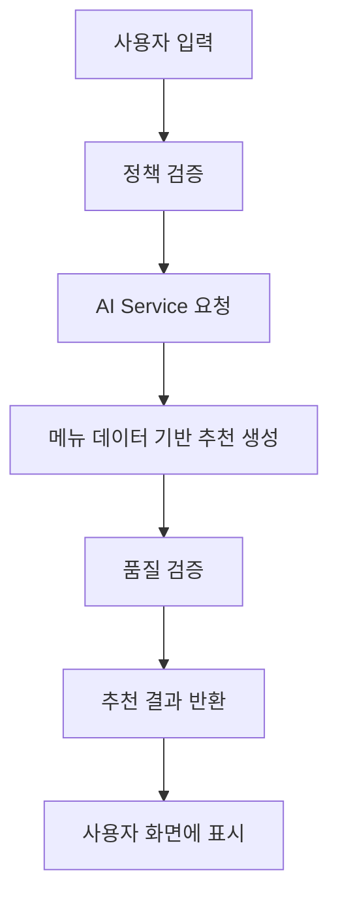
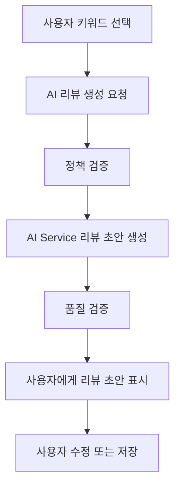

# Software Requirements Specification

## AI 기반 식당 서비스 시스템

## 1. 시스템 개요

본 시스템은 웹 기반 식당 서비스 플랫폼으로, 사용자가 식당의 메뉴를 조회하고 주문을 생성하며 AI 기반 추천 및 후기 생성 기능을 활용할 수 있도록 설계된 시스템이다.

기존의 단순 주문 시스템이 메뉴 확인 및 직접 선택 중심이었다면, 본 시스템은 다음 데이터를 활용해 더 지능적인 식당 이용 경험을 제공하는 것을 목표로 한다.

- 사용자 취향
- 주문 이력
- 리뷰 데이터
- 시간대별 주문량

시스템은 다음 구성 요소로 이루어진다.

- 고객용 웹
- 식당 관리자용 웹
- 서비스 백엔드
- AI 서비스 백엔드
- 데이터베이스
- 캐시 저장소

고객은 다음 기능을 사용할 수 있다.

- 메뉴 조회
- 장바구니 관리
- 주문 생성
- 주문 상태 확인
- 재주문
- 즐겨찾기
- 리뷰 작성
- AI 메뉴 추천
- AI 후기 자동 생성

관리자는 다음 기능을 사용할 수 있다.

- 메뉴 관리
- 주문 관리
- 후기 관리
- 재고 관리
- 매출 관리
- 관리자 대시보드
- AI 신메뉴 추천 조회

본 시스템은 Microservice Architecture를 기반으로 설계되며, 기능을 독립된 서비스 단위로 분리한다. 이를 통해 기능 변경의 영향 범위를 줄이고, 사용자 수 증가나 기능 확장에 유연하게 대응할 수 있어야 한다. 또한 Redis 기반 캐싱 전략을 적용하여 자주 조회되는 메뉴 데이터, 인기 메뉴, 추천 결과 등의 응답 속도를 개선한다.

본 문서는 AI 기반 식당 서비스 시스템의 기능 요구사항, AI 기능 정의, 데이터 설계, API 설계, 캐싱 전략, 비기능 요구사항, 정책 정의, 화면 설계를 상세히 정의한다.

## 2. 사용자 정의

### 2.1 일반 사용자

일반 사용자는 식당 서비스를 이용하는 고객을 의미한다. 웹 브라우저를 통해 시스템에 접속하여 메뉴를 조회하고 장바구니에 메뉴를 담고 주문을 생성할 수 있다. 또한 자신의 주문 상태 및 과거 주문 내역을 조회하고, 이전 주문을 기반으로 재주문할 수 있다.

일반 사용자는 AI 메뉴 추천 기능을 통해 자연어 입력 또는 키워드 선택 방식으로 메뉴를 추천받을 수 있으며, 주문한 메뉴에 대해 리뷰를 작성할 수 있다. 리뷰 작성 시 직접 문장을 입력하거나 AI가 생성한 리뷰 초안을 수정하여 저장할 수 있다.

일반 사용자가 사용할 수 있어야 하는 기능은 다음과 같다.

- 메뉴 조회
- 메뉴 상세 조회
- 메뉴 검색, 필터, 정렬
- 장바구니 관리
- 주문 생성
- 주문 상태 조회
- 주문 이력 조회
- 재주문
- 즐겨찾기 관리
- 리뷰 작성, 수정, 삭제
- AI 메뉴 추천
- AI 후기 자동 생성
- 개인화 추천 조회
- 알림 조회

### 2.2 관리자

관리자는 식당 서비스를 운영하고 관리하는 사용자를 의미한다. 일반 사용자보다 높은 권한을 가지며 메뉴, 주문, 리뷰, 재고, 매출, 통계 데이터를 관리할 수 있다.

관리자는 메뉴를 등록, 수정, 삭제하거나 품절 및 판매 중지 상태로 변경할 수 있다. 또한 사용자의 주문을 조회하고 주문 상태를 변경할 수 있으며, 부적절한 리뷰를 삭제하거나 비활성화할 수 있다. 대시보드를 통해 당일 주문 수, 당일 매출, 인기 메뉴, 시간대별 주문량, 품절 메뉴, 최근 리뷰 등을 확인할 수 있어야 한다.

관리자가 사용할 수 있어야 하는 기능은 다음과 같다.

- 메뉴 등록, 수정, 삭제
- 메뉴 판매 상태 변경
- 주문 목록 조회
- 주문 상세 조회
- 주문 상태 변경
- 주문 취소 처리
- 리뷰 조회 및 관리
- 재고 등록 및 수정
- 품절 처리
- 매출 조회
- 관리자 대시보드 조회
- 인기 메뉴 분석
- 시간대별 주문량 분석
- AI 신메뉴 추천 조회

### 2.3 AI 서비스

AI 서비스는 사용자와 관리자를 보조하는 독립 서비스이다. 사용자 입력, 주문 이력, 리뷰 데이터, 메뉴 데이터, 판매 데이터를 기반으로 다음 기능을 수행한다.

- 메뉴 추천
- 개인화 추천
- 후기 생성
- 리뷰 요약
- 신메뉴 추천
- 정책 검증
- 품질 검증

AI 서비스는 단순 텍스트 생성에 그치지 않고 실제 서비스 데이터와 연결되어야 한다. AI가 추천하는 메뉴는 반드시 현재 시스템에 등록된 메뉴여야 하며, 품절 또는 판매 중지된 메뉴는 추천 결과에서 제외되어야 한다.

## 3. 아키텍처 및 기술 스택

### 3.1 시스템 아키텍처

본 시스템은 Microservice Architecture 기반으로 설계된다. 고객용 웹과 관리자용 웹을 프론트엔드로 제공하며, 클라이언트 요청은 API Gateway를 통해 각 서비스로 전달된다.

각 서비스는 기능 단위로 분리되어 독립적으로 개발, 배포, 확장될 수 있어야 한다.

- 메뉴 조회 요청은 `Menu Service`가 처리한다.
- 주문 생성 요청은 `Order Service`가 처리한다.
- AI 추천 요청은 `AI Service`가 처리한다.

시스템 전체 구조는 다음과 같다.



### 3.2 기술 스택

| 구분 | 기술 |
| --- | --- |
| 고객용 프론트엔드 | Vue.js, Vite |
| 관리자용 프론트엔드 | Vue.js, Vite |
| 서비스 백엔드 | Java, Spring Boot |
| AI 백엔드 | Python, FastAPI |
| 데이터베이스 | SQLite |
| 캐시 저장소 | Redis |
| 인증 방식 | JWT |
| 통신 방식 | REST API, JSON |
| 배포 방식 | Docker 기반 컨테이너 배포 |
| 환경 변수 관리 | `.env` |

### 3.3 시스템 설계 원칙

1. 기능별 책임을 명확히 분리한다.
2. 서비스 간 결합도를 낮춘다.
3. 데이터 무결성을 보장한다.
4. 사용자 입력은 서버 측에서 반드시 검증한다.
5. AI 응답은 정책 및 품질 검증을 거친 뒤 제공한다.
6. 자주 조회되는 데이터는 캐싱하여 성능을 개선한다.
7. 관리자 기능은 일반 사용자 기능과 명확히 분리한다.
8. 향후 기능 확장을 고려하여 데이터 구조와 API를 설계한다.

## 4. 서비스 분해

### 4.1 API Gateway

API Gateway는 클라이언트의 모든 요청을 수신하고 적절한 내부 서비스로 라우팅한다. 또한 인증 토큰 검증, 공통 로깅, 요청 제한, 공통 오류 응답 처리 등의 기능을 담당한다.

API Gateway는 다음 기능을 수행해야 한다.

1. 클라이언트 요청을 수신할 수 있어야 한다.
2. 요청 URI와 HTTP Method를 기준으로 내부 서비스로 요청을 전달해야 한다.
3. 인증이 필요한 요청에 대해 JWT 토큰을 검증해야 한다.
4. 사용자 권한에 따라 접근 가능 여부를 판단해야 한다.
5. 공통 오류 응답 형식을 제공해야 한다.
6. 요청 및 응답 로그를 기록할 수 있어야 한다.
7. 특정 요청이 과도하게 발생할 경우 요청 제한 정책을 적용할 수 있어야 한다.

### 4.2 User Service

User Service는 사용자 정보, 인증, 권한 관리를 담당한다.

1. 사용자 로그인 요청을 처리해야 한다.
2. 로그인 성공 시 JWT Access Token을 발급해야 한다.
3. 사용자 역할을 `USER`, `ADMIN`으로 구분해야 한다.
4. 인증 토큰의 유효성을 검증해야 한다.
5. 토큰이 만료된 경우 재로그인을 요구해야 한다.
6. 관리자 권한이 필요한 요청에 대해 권한 검증을 수행해야 한다.
7. 사용자 정보를 조회할 수 있어야 한다.

### 4.3 Menu Service

Menu Service는 식당 메뉴 데이터를 관리하는 서비스이다.

1. 전체 메뉴 목록을 조회할 수 있어야 한다.
2. 카테고리별 메뉴 목록을 조회할 수 있어야 한다.
3. 메뉴 상세 정보를 조회할 수 있어야 한다.
4. 메뉴 검색 기능을 제공해야 한다.
5. 메뉴 필터 및 정렬 기능을 제공해야 한다.
6. 관리자가 메뉴를 등록할 수 있어야 한다.
7. 관리자가 메뉴 정보를 수정할 수 있어야 한다.
8. 관리자가 메뉴를 삭제 또는 비활성화할 수 있어야 한다.
9. 메뉴의 판매 가능 여부를 관리할 수 있어야 한다.
10. 메뉴의 품절 여부를 관리할 수 있어야 한다.

### 4.4 Order Service

Order Service는 주문 생성, 주문 상태 관리, 주문 이력, 재주문 기능을 담당한다.

1. 장바구니 데이터를 기반으로 주문을 생성해야 한다.
2. 주문 생성 시 최신 메뉴 가격과 판매 가능 여부를 검증해야 한다.
3. 주문 생성 후 주문 상태를 `RECEIVED`로 설정해야 한다.
4. 주문 상태를 관리할 수 있어야 한다.
5. 사용자가 자신의 주문 목록을 조회할 수 있어야 한다.
6. 사용자가 주문 상세 정보를 조회할 수 있어야 한다.
7. 사용자가 과거 주문을 기반으로 재주문할 수 있어야 한다.
8. 관리자가 전체 주문 목록을 조회할 수 있어야 한다.
9. 관리자가 주문 상태를 변경할 수 있어야 한다.
10. 취소된 주문은 매출 집계에서 제외되어야 한다.

### 4.5 Review Service

Review Service는 사용자 리뷰를 관리하는 서비스이다.

1. 사용자가 주문한 메뉴에 대해 리뷰를 작성할 수 있어야 한다.
2. 사용자가 작성한 리뷰를 수정할 수 있어야 한다.
3. 사용자가 작성한 리뷰를 삭제할 수 있어야 한다.
4. 메뉴별 리뷰 목록을 조회할 수 있어야 한다.
5. 리뷰 작성 시 별점은 1점 이상 5점 이하로 제한해야 한다.
6. 리뷰 작성 시 부적절한 표현을 검증해야 한다.
7. 관리자가 전체 리뷰를 조회할 수 있어야 한다.
8. 관리자가 부적절한 리뷰를 비활성화할 수 있어야 한다.
9. AI 생성 리뷰인지 여부를 저장할 수 있어야 한다.

### 4.6 Inventory Service

Inventory Service는 메뉴별 재고와 품절 상태를 관리하는 서비스이다.

1. 관리자가 메뉴별 재고 수량을 등록할 수 있어야 한다.
2. 관리자가 메뉴별 재고 수량을 수정할 수 있어야 한다.
3. 주문 생성 시 해당 메뉴의 재고를 차감해야 한다.
4. 재고가 0이 된 메뉴는 자동으로 품절 상태로 변경되어야 한다.
5. 품절 메뉴는 주문할 수 없어야 한다.
6. 주문 취소 시 재고를 복구할 수 있어야 한다.
7. 재고 변경 이력을 기록할 수 있어야 한다.
8. 재고 부족 메뉴를 관리자 대시보드에 표시해야 한다.

### 4.7 Analytics Service

Analytics Service는 주문, 매출, 리뷰, 사용자 행동 데이터를 분석하는 서비스이다.

1. 일별 매출을 계산해야 한다.
2. 월별 매출을 계산해야 한다.
3. 기간별 매출을 계산해야 한다.
4. 메뉴별 판매량을 계산해야 한다.
5. 카테고리별 판매량을 계산해야 한다.
6. 인기 메뉴 순위를 계산해야 한다.
7. 시간대별 주문량을 계산해야 한다.
8. 혼잡도를 분석해야 한다.
9. 관리자 대시보드에 분석 결과를 제공해야 한다.
10. AI 신메뉴 추천에 필요한 분석 데이터를 제공할 수 있어야 한다.

### 4.8 Notification Service

Notification Service는 주문 상태 변경, 주문 완료, 주문 취소 등의 이벤트 발생 시 사용자에게 알림을 제공하는 서비스이다.

1. 주문 상태가 변경되면 사용자에게 알림을 생성해야 한다.
2. 주문이 `READY` 상태가 되면 준비 완료 알림을 생성해야 한다.
3. 주문이 `CANCELED` 상태가 되면 취소 알림을 생성해야 한다.
4. 사용자가 알림 목록을 조회할 수 있어야 한다.
5. 사용자가 알림을 읽음 처리할 수 있어야 한다.
6. 알림 생성 시간을 기록해야 한다.

### 4.9 AI Service

AI Service는 메뉴 추천, 개인화 추천, 후기 자동 생성, 리뷰 요약, 신메뉴 추천, 정책 검증, 품질 검증 기능을 담당한다.

1. 사용자 입력 기반 메뉴 추천을 수행해야 한다.
2. 사용자 주문 이력 기반 개인화 추천을 수행해야 한다.
3. 키워드 기반 후기 자동 생성을 수행해야 한다.
4. 메뉴별 리뷰 요약을 수행해야 한다.
5. 주문 및 리뷰 데이터를 기반으로 신메뉴 추천을 수행해야 한다.
6. 사용자 입력에 대한 정책 검증을 수행해야 한다.
7. AI 출력에 대한 정책 검증을 수행해야 한다.
8. AI 응답이 실제 메뉴 데이터와 일치하는지 검증해야 한다.
9. AI 응답 품질이 낮은 경우 기본 응답을 제공해야 한다.

## 5. 인증 및 권한

### 5.1 인증 방식

본 시스템은 JWT 기반 인증 방식을 사용한다. 사용자가 로그인에 성공하면 시스템은 Access Token을 발급하며, 사용자는 이후 요청마다 토큰을 포함하여 서버에 요청해야 한다.

### 5.2 권한 구분

| 권한 | 설명 |
| --- | --- |
| `USER` | 일반 사용자 권한 |
| `ADMIN` | 관리자 권한 |

### 5.3 인증 요구사항

1. 사용자는 로그인 후 시스템 기능을 사용할 수 있어야 한다.
2. 시스템은 로그인 성공 시 인증 토큰을 발급해야 한다.
3. 인증되지 않은 사용자는 주문, 리뷰, 즐겨찾기, 개인화 추천 기능을 사용할 수 없어야 한다.
4. 관리자 권한이 없는 사용자는 관리자 기능에 접근할 수 없어야 한다.
5. 토큰이 만료된 경우 사용자는 다시 로그인해야 한다.
6. 모든 API 요청은 권한 검증을 수행해야 한다.
7. 인증 실패 시 시스템은 적절한 오류 메시지를 반환해야 한다.

## 6. 기능 요구사항

### 6.1 고객 기능

#### 6.1.1 메뉴 조회 기능

사용자는 식당에서 제공하는 메뉴를 조회할 수 있어야 하며, 메뉴는 카테고리별로 분류되어야 한다.

세부 요구사항

1. 시스템은 사용자에게 전체 메뉴 목록을 제공해야 한다.
2. 시스템은 메뉴를 카테고리별로 구분하여 제공해야 한다.
3. 사용자는 특정 카테고리를 선택하여 해당 카테고리에 포함된 메뉴만 조회할 수 있어야 한다.
4. 메뉴 목록에는 메뉴 이름, 메뉴 가격, 메뉴 이미지, 메뉴 카테고리, 메뉴 설명, 판매 가능 여부, 예상 조리 시간이 포함되어야 한다.
5. 시스템은 판매 중지 또는 품절 상태인 메뉴를 구분하여 표시해야 한다.
6. 사용자는 메뉴 목록을 가격 낮은 순, 가격 높은 순, 인기순, 평점순, 최신 등록순으로 정렬할 수 있어야 한다.
7. 사용자는 메뉴를 키워드로 검색할 수 있어야 한다.
8. 사용자가 검색어를 입력하면 시스템은 메뉴 이름, 카테고리, 설명에 해당 검색어가 포함된 메뉴를 조회해야 한다.
9. 검색 결과가 없을 경우 시스템은 `검색 결과가 없습니다.`라는 안내 메시지를 표시해야 한다.
10. 시스템은 메뉴 조회 요청 시 데이터베이스에서 최신 메뉴 정보를 조회하거나 캐시된 메뉴 데이터를 반환할 수 있어야 한다.

예외 처리

1. 존재하지 않는 카테고리를 요청할 경우 빈 목록을 반환해야 한다.
2. 서버 오류가 발생한 경우 사용자에게 메뉴를 불러올 수 없다는 안내 메시지를 제공해야 한다.
3. 네트워크 오류가 발생한 경우 재시도 안내를 제공해야 한다.

#### 6.1.2 메뉴 상세 조회 기능

사용자는 특정 메뉴를 선택하여 상세 정보를 확인할 수 있어야 한다.

세부 요구사항

1. 사용자는 메뉴 목록에서 특정 메뉴를 선택할 수 있어야 한다.
2. 시스템은 선택된 메뉴의 상세 정보를 제공해야 한다.
3. 메뉴 상세 정보에는 메뉴 이름, 가격, 이미지, 상세 설명, 카테고리, 예상 조리 시간, 평균 평점, 리뷰 개수, 판매 가능 여부, 품절 여부가 포함되어야 한다.
4. 시스템은 해당 메뉴에 대한 사용자 리뷰 목록을 함께 제공할 수 있어야 한다.
5. 메뉴가 품절 상태일 경우 주문 버튼은 비활성화되어야 한다.
6. 메뉴가 판매 중지 상태일 경우 사용자에게 주문 불가 안내를 제공해야 한다.
7. 사용자는 메뉴 상세 화면에서 해당 메뉴를 장바구니에 추가할 수 있어야 한다.
8. 사용자는 메뉴 상세 화면에서 해당 메뉴를 즐겨찾기에 추가하거나 해제할 수 있어야 한다.

예외 처리

1. 존재하지 않는 메뉴 ID를 요청할 경우 오류 메시지를 반환해야 한다.
2. 삭제된 메뉴에 접근할 경우 `존재하지 않는 메뉴입니다.`라는 메시지를 제공해야 한다.

#### 6.1.3 메뉴 필터 및 정렬 기능

사용자는 조건을 설정하여 원하는 메뉴를 빠르게 찾을 수 있어야 한다.

세부 요구사항

1. 사용자는 메뉴를 카테고리 기준으로 필터링할 수 있어야 한다.
2. 사용자는 메뉴를 가격 범위 기준으로 필터링할 수 있어야 한다.
3. 사용자는 판매 가능 메뉴만 조회할 수 있어야 한다.
4. 사용자는 품절 메뉴를 제외하고 조회할 수 있어야 한다.
5. 사용자는 인기 메뉴만 조회할 수 있어야 한다.
6. 사용자는 평점이 높은 메뉴를 우선적으로 조회할 수 있어야 한다.
7. 사용자는 필터 조건을 여러 개 동시에 적용할 수 있어야 한다.
8. 사용자는 적용된 필터 조건을 초기화할 수 있어야 한다.
9. 시스템은 필터링된 결과를 사용자에게 즉시 반영해야 한다.
10. 시스템은 필터 결과가 없는 경우 안내 메시지를 제공해야 한다.

예외 처리

1. 잘못된 가격 범위가 입력된 경우 시스템은 유효한 범위를 입력하도록 안내해야 한다.
2. 필터 조건이 서로 충돌하여 결과가 없을 경우 빈 목록과 안내 메시지를 제공해야 한다.

#### 6.1.4 장바구니 관리 기능

장바구니는 주문 전 임시 저장 공간으로 동작하며, 사용자의 선택 내용을 유지해야 한다.

세부 요구사항

1. 사용자는 메뉴를 장바구니에 추가할 수 있어야 한다.
2. 동일한 메뉴를 다시 추가할 경우 시스템은 기존 항목의 수량을 증가시켜야 한다.
3. 사용자는 장바구니에 담긴 메뉴 수량을 변경할 수 있어야 한다.
4. 사용자는 장바구니에 담긴 메뉴를 삭제할 수 있어야 한다.
5. 사용자는 장바구니 전체를 비울 수 있어야 한다.
6. 시스템은 장바구니에 담긴 메뉴별 금액을 계산해야 한다.
7. 시스템은 장바구니 전체 주문 금액을 자동 계산해야 한다.
8. 장바구니 데이터는 클라이언트 `localStorage`에 저장되어야 한다.
9. 사용자가 페이지를 새로고침해도 장바구니 데이터는 유지되어야 한다.
10. 사용자가 주문을 완료하면 장바구니는 초기화되어야 한다.
11. 장바구니에는 현재 판매 가능한 메뉴만 주문 가능 상태로 표시되어야 한다.
12. 장바구니에 담긴 메뉴가 품절되었거나 판매 중지되었을 경우 시스템은 주문 전 이를 사용자에게 알려야 한다.

예외 처리

1. 수량이 0 이하로 입력될 경우 해당 요청은 허용되지 않아야 한다.
2. 품절 메뉴가 장바구니에 포함된 경우 주문 요청을 차단해야 한다.
3. 가격 정보가 변경된 경우 주문 전 최신 가격을 반영해야 한다.

#### 6.1.5 주문 생성 기능

사용자는 장바구니에 담긴 메뉴를 기반으로 주문을 생성할 수 있어야 한다.

세부 요구사항

1. 사용자는 장바구니에 하나 이상의 메뉴가 있을 때 주문을 생성할 수 있어야 한다.
2. 시스템은 주문 요청 시 장바구니 데이터를 서버로 전달받아야 한다.
3. 시스템은 주문 요청에 포함된 메뉴가 실제로 존재하는지 확인해야 한다.
4. 시스템은 주문 요청에 포함된 메뉴가 판매 가능한 상태인지 확인해야 한다.
5. 시스템은 주문 수량이 유효한 값인지 확인해야 한다.
6. 시스템은 서버에 저장된 최신 메뉴 가격을 기준으로 총 금액을 다시 계산해야 한다.
7. 시스템은 클라이언트에서 전달한 총 금액을 그대로 신뢰하지 않아야 한다.
8. 주문 생성이 완료되면 시스템은 주문 ID를 생성해야 한다.
9. 주문 생성 직후 주문 상태는 `RECEIVED`로 설정되어야 한다.
10. 주문 데이터는 `Order`, `OrderItem`으로 나누어 저장되어야 한다.
11. 주문 완료 후 사용자는 주문 완료 메시지를 확인할 수 있어야 한다.
12. 주문 완료 후 사용자는 주문 상태 화면으로 이동할 수 있어야 한다.
13. 주문 완료 후 관리자 화면에서 해당 주문이 조회되어야 한다.

예외 처리

1. 장바구니가 비어 있는 경우 주문 요청은 거부되어야 한다.
2. 품절 메뉴가 포함된 경우 주문 요청은 거부되어야 한다.
3. 메뉴 가격이 변경된 경우 시스템은 최신 금액을 사용자에게 안내해야 한다.
4. 주문 저장 중 오류가 발생한 경우 주문은 생성되지 않아야 하며, 사용자에게 실패 메시지를 제공해야 한다.

#### 6.1.6 주문 상태 조회 기능

사용자는 자신이 생성한 주문의 현재 상태를 확인할 수 있어야 한다.

주문 상태 정의

| 상태 | 설명 |
| --- | --- |
| `RECEIVED` | 주문이 접수된 상태 |
| `COOKING` | 조리가 진행 중인 상태 |
| `READY` | 음식 준비가 완료된 상태 |
| `COMPLETED` | 주문 처리가 완료된 상태 |
| `CANCELED` | 주문이 취소된 상태 |

세부 요구사항

1. 사용자는 자신의 주문 목록에서 각 주문의 상태를 확인할 수 있어야 한다.
2. 시스템은 주문 상태를 실시간 또는 주기적으로 갱신하여 사용자에게 제공해야 한다.
3. 주문 상태가 변경되면 사용자 화면에 변경된 상태가 반영되어야 한다.
4. 주문 상태는 정해진 순서에 따라 변경되어야 한다.
5. 사용자는 주문 상세 화면에서 주문 시간, 주문 항목, 총 금액, 현재 상태를 확인할 수 있어야 한다.
6. `READY` 상태가 되면 사용자는 음식 준비 완료 안내를 확인할 수 있어야 한다.
7. `COMPLETED` 상태가 되면 해당 주문은 주문 이력으로 분류되어야 한다.

상태 전이 규칙

1. `RECEIVED` 상태는 `COOKING` 또는 `CANCELED`로 변경될 수 있다.
2. `COOKING` 상태는 `READY`로 변경될 수 있다.
3. `READY` 상태는 `COMPLETED`로 변경될 수 있다.
4. `COMPLETED` 상태는 다른 상태로 변경될 수 없다.
5. `CANCELED` 상태는 다른 상태로 변경될 수 없다.

예외 처리

1. 존재하지 않는 주문을 조회할 경우 오류 메시지를 반환해야 한다.
2. 다른 사용자의 주문 상태는 조회할 수 없어야 한다.
3. 이미 완료된 주문은 취소할 수 없어야 한다.

#### 6.1.7 주문 이력 조회 기능

세부 요구사항

1. 사용자는 자신의 전체 주문 이력을 조회할 수 있어야 한다.
2. 주문 이력은 최신순으로 정렬되어야 한다.
3. 사용자는 특정 기간의 주문 이력을 조회할 수 있어야 한다.
4. 각 주문 이력에는 주문 ID, 주문 일시, 주문 메뉴 목록, 총 결제 금액, 주문 상태가 포함되어야 한다.
5. 사용자는 특정 주문을 선택하여 상세 내역을 확인할 수 있어야 한다.
6. 시스템은 로그인한 사용자의 주문 이력만 제공해야 한다.
7. 주문 이력은 개인화 추천 기능의 입력 데이터로 활용될 수 있어야 한다.

예외 처리

1. 주문 이력이 없는 경우 `주문 내역이 없습니다.`라는 메시지를 표시해야 한다.
2. 인증되지 않은 사용자는 주문 이력을 조회할 수 없어야 한다.

#### 6.1.8 재주문 기능

세부 요구사항

1. 사용자는 주문 이력에서 특정 주문을 선택하여 재주문할 수 있어야 한다.
2. 시스템은 선택한 주문에 포함된 메뉴 목록과 수량을 불러와야 한다.
3. 시스템은 재주문 요청 시 현재 메뉴 판매 가능 여부를 다시 확인해야 한다.
4. 시스템은 재주문 요청 시 현재 메뉴 가격을 다시 조회해야 한다.
5. 과거 주문에 포함된 메뉴 중 일부가 품절 또는 판매 중지된 경우 사용자에게 안내해야 한다.
6. 사용자는 재주문 전 메뉴 수량을 수정할 수 있어야 한다.
7. 사용자는 재주문 전 일부 메뉴를 제외할 수 있어야 한다.
8. 재주문은 새로운 주문으로 생성되어야 한다.
9. 재주문 생성 시 기존 주문 ID와는 별도의 새로운 주문 ID가 부여되어야 한다.
10. 재주문 완료 후 기존 주문 이력은 변경되지 않아야 한다.

예외 처리

1. 과거 주문에 포함된 모든 메뉴가 판매 불가능한 경우 재주문을 진행할 수 없어야 한다.
2. 가격이 변경된 메뉴가 있을 경우 시스템은 변경된 금액을 사용자에게 안내해야 한다.
3. 재주문 중 서버 오류가 발생하면 새로운 주문은 생성되지 않아야 한다.

#### 6.1.9 즐겨찾기 기능

세부 요구사항

1. 사용자는 메뉴 상세 화면에서 메뉴를 즐겨찾기에 추가할 수 있어야 한다.
2. 사용자는 즐겨찾기에 추가된 메뉴를 해제할 수 있어야 한다.
3. 사용자는 자신의 즐겨찾기 메뉴 목록을 조회할 수 있어야 한다.
4. 동일한 메뉴는 한 사용자에게 중복 즐겨찾기될 수 없어야 한다.
5. 즐겨찾기 목록에는 메뉴 이름, 가격, 이미지, 판매 가능 여부가 표시되어야 한다.
6. 품절 또는 판매 중지된 메뉴는 즐겨찾기 목록에서 상태가 표시되어야 한다.
7. 즐겨찾기 데이터는 개인화 추천의 참고 데이터로 활용될 수 있어야 한다.

예외 처리

1. 존재하지 않는 메뉴를 즐겨찾기에 추가할 수 없어야 한다.
2. 인증되지 않은 사용자는 즐겨찾기 기능을 사용할 수 없어야 한다.
3. 이미 즐겨찾기한 메뉴를 다시 추가할 경우 중복 저장하지 않아야 한다.

#### 6.1.10 리뷰 작성 기능

세부 요구사항

1. 사용자는 자신이 주문한 메뉴에 대해서만 리뷰를 작성할 수 있어야 한다.
2. 리뷰는 텍스트 내용과 별점을 포함해야 한다.
3. 별점은 1점 이상 5점 이하의 정수로 입력되어야 한다.
4. 리뷰 내용은 최소 길이와 최대 길이 제한을 가져야 한다.
5. 사용자는 하나의 주문 메뉴에 대해 하나의 리뷰만 작성할 수 있어야 한다.
6. 사용자는 작성한 리뷰를 조회할 수 있어야 한다.
7. 사용자는 작성한 리뷰를 수정할 수 있어야 한다.
8. 사용자는 작성한 리뷰를 삭제할 수 있어야 한다.
9. 시스템은 리뷰 작성 시 부적절한 표현이 포함되어 있는지 검증해야 한다.
10. 리뷰가 저장되면 해당 메뉴의 평균 평점 계산에 반영되어야 한다.

예외 처리

1. 주문하지 않은 메뉴에는 리뷰를 작성할 수 없어야 한다.
2. 별점이 유효 범위를 벗어난 경우 저장할 수 없어야 한다.
3. 부적절한 표현이 포함된 리뷰는 저장이 제한되어야 한다.

### 6.2 관리자 기능

#### 6.2.1 메뉴 관리 기능

세부 요구사항

1. 관리자는 새로운 메뉴를 등록할 수 있어야 한다.
2. 메뉴 등록 시 메뉴 이름, 가격, 카테고리, 이미지, 설명, 예상 조리 시간, 판매 상태를 입력해야 한다.
3. 시스템은 메뉴 이름이 비어 있는 경우 등록을 허용하지 않아야 한다.
4. 시스템은 가격이 0 이하인 경우 등록을 허용하지 않아야 한다.
5. 관리자는 기존 메뉴 정보를 수정할 수 있어야 한다.
6. 관리자는 메뉴의 판매 상태를 변경할 수 있어야 한다.
7. 관리자는 메뉴를 품절 상태로 변경할 수 있어야 한다.
8. 관리자는 메뉴를 삭제할 수 있어야 한다.
9. 이미 주문 이력이 있는 메뉴는 물리적으로 삭제하지 않고 비활성화 처리할 수 있어야 한다.
10. 메뉴 정보가 변경되면 사용자 화면에 최신 정보가 반영되어야 한다.

예외 처리

1. 필수 입력값이 누락된 경우 저장할 수 없어야 한다.
2. 잘못된 가격 또는 조리 시간이 입력된 경우 오류 메시지를 제공해야 한다.
3. 주문 이력이 있는 메뉴를 삭제하려는 경우 비활성화 처리해야 한다.

#### 6.2.2 주문 관리 기능

세부 요구사항

1. 관리자는 전체 주문 목록을 조회할 수 있어야 한다.
2. 관리자는 주문을 날짜, 상태, 사용자, 금액 기준으로 필터링할 수 있어야 한다.
3. 관리자는 특정 주문의 상세 정보를 조회할 수 있어야 한다.
4. 주문 상세 정보에는 주문자, 주문 메뉴, 수량, 총 금액, 주문 상태, 주문 시간이 포함되어야 한다.
5. 관리자는 주문 상태를 변경할 수 있어야 한다.
6. 주문 상태는 정해진 상태 전이 규칙에 따라 변경되어야 한다.
7. 상태가 변경되면 사용자 화면에도 변경된 상태가 반영되어야 한다.
8. 관리자는 잘못 접수된 주문을 취소 처리할 수 있어야 한다.
9. 취소된 주문은 매출 집계에서 제외되어야 한다.
10. 주문 상태 변경 이력은 기록되어야 한다.

예외 처리

1. 존재하지 않는 주문 상태로 변경할 수 없어야 한다.
2. `COMPLETED` 상태의 주문은 `CANCELED`로 변경할 수 없어야 한다.
3. 권한이 없는 사용자는 주문 관리 기능에 접근할 수 없어야 한다.

#### 6.2.3 후기 관리 기능

세부 요구사항

1. 관리자는 전체 리뷰 목록을 조회할 수 있어야 한다.
2. 관리자는 메뉴별 리뷰를 조회할 수 있어야 한다.
3. 관리자는 사용자별 리뷰를 조회할 수 있어야 한다.
4. 관리자는 별점 기준으로 리뷰를 필터링할 수 있어야 한다.
5. 관리자는 부적절한 리뷰를 삭제할 수 있어야 한다.
6. 리뷰 삭제 시 실제 삭제 대신 비활성화 처리할 수 있어야 한다.
7. 비활성화된 리뷰는 사용자 화면에 노출되지 않아야 한다.
8. 리뷰 삭제 또는 비활성화 이력은 기록되어야 한다.
9. AI가 생성한 리뷰인지 여부를 구분하여 조회할 수 있어야 한다.
10. 리뷰 데이터는 메뉴 평점 계산에 반영되어야 한다.

예외 처리

1. 존재하지 않는 리뷰를 삭제하려는 경우 오류 메시지를 반환해야 한다.
2. 권한이 없는 사용자는 리뷰 관리 기능에 접근할 수 없어야 한다.

#### 6.2.4 매출 관리 기능

세부 요구사항

1. 관리자는 전체 매출을 조회할 수 있어야 한다.
2. 관리자는 일별 매출을 조회할 수 있어야 한다.
3. 관리자는 월별 매출을 조회할 수 있어야 한다.
4. 관리자는 기간을 직접 설정하여 매출을 조회할 수 있어야 한다.
5. 시스템은 취소된 주문을 매출 계산에서 제외해야 한다.
6. 시스템은 완료된 주문을 기준으로 매출을 집계해야 한다.
7. 매출 조회 결과에는 총 주문 수, 총 매출, 평균 주문 금액이 포함되어야 한다.
8. 관리자는 메뉴별 매출을 조회할 수 있어야 한다.
9. 관리자는 카테고리별 매출을 조회할 수 있어야 한다.
10. 매출 데이터는 대시보드와 분석 기능에 활용될 수 있어야 한다.

예외 처리

1. 조회 기간이 잘못 입력된 경우 오류 메시지를 제공해야 한다.
2. 매출 데이터가 없는 기간의 경우 0원으로 표시해야 한다.

#### 6.2.5 관리자 대시보드 기능

세부 요구사항

1. 대시보드는 주요 운영 지표를 제공해야 한다.
2. 대시보드에는 당일 주문 수가 표시되어야 한다.
3. 대시보드에는 당일 매출이 표시되어야 한다.
4. 대시보드에는 인기 메뉴 순위가 표시되어야 한다.
5. 대시보드에는 시간대별 주문량이 표시되어야 한다.
6. 대시보드에는 품절 메뉴 목록이 표시되어야 한다.
7. 대시보드에는 최근 리뷰 목록이 표시되어야 한다.
8. 대시보드에는 AI가 제안한 신메뉴 추천 결과가 표시될 수 있어야 한다.
9. 대시보드 데이터는 일정 주기마다 갱신되어야 한다.
10. 관리자는 대시보드에서 상세 관리 화면으로 이동할 수 있어야 한다.

예외 처리

1. 데이터 조회 실패 시 각 영역에 오류 안내를 표시해야 한다.
2. 데이터가 없는 경우 빈 상태 화면을 표시해야 한다.

#### 6.2.6 재고 관리 기능

세부 요구사항

1. 관리자는 메뉴별 재고 수량을 등록할 수 있어야 한다.
2. 관리자는 메뉴별 재고 수량을 수정할 수 있어야 한다.
3. 시스템은 주문이 생성될 때 해당 메뉴의 재고를 차감해야 한다.
4. 재고가 0이 된 메뉴는 자동으로 품절 상태로 변경되어야 한다.
5. 품절 메뉴는 주문할 수 없어야 한다.
6. 관리자는 수동으로 메뉴를 품절 처리할 수 있어야 한다.
7. 관리자는 품절 상태를 해제할 수 있어야 한다.
8. 시스템은 재고 부족 메뉴를 관리자 대시보드에 표시해야 한다.
9. 시스템은 재고 변경 이력을 기록할 수 있어야 한다.
10. 주문 취소 시 재고를 복구할 수 있어야 한다.

예외 처리

1. 재고보다 많은 수량을 주문할 수 없어야 한다.
2. 음수 재고는 허용되지 않아야 한다.
3. 품절 메뉴는 장바구니에 담겨 있더라도 주문 생성 시 차단되어야 한다.

## 7. AI 기능 정의

### 7.1 AI 메뉴 추천 기능

AI 메뉴 추천 기능은 사용자의 입력을 분석하여 현재 판매 가능한 메뉴 중 적절한 메뉴를 추천하는 기능이다.

세부 요구사항

1. 사용자는 자연어 문장으로 추천을 요청할 수 있어야 한다.
2. 사용자는 키워드 선택 방식으로 추천을 요청할 수 있어야 한다.
3. AI는 사용자의 입력 의도를 분석해야 한다.
4. AI는 메뉴 데이터베이스에 존재하는 메뉴만 추천해야 한다.
5. AI는 품절 또는 판매 중지된 메뉴를 추천하지 않아야 한다.
6. AI는 추천 이유를 함께 제공해야 한다.
7. AI는 사용자의 선호 정보가 있는 경우 이를 반영해야 한다.
8. AI 추천 결과는 사용자 화면에 메뉴 카드 형태로 표시되어야 한다.
9. 사용자는 추천 메뉴를 장바구니에 바로 추가할 수 있어야 한다.
10. 추천 실패 시 기본 인기 메뉴를 제공해야 한다.

### 7.2 개인화 추천 기능

세부 요구사항

1. 시스템은 사용자별 주문 이력을 분석해야 한다.
2. 시스템은 사용자별 선호 카테고리를 계산해야 한다.
3. 시스템은 자주 주문한 메뉴를 기준으로 유사 메뉴를 추천해야 한다.
4. 시스템은 즐겨찾기한 메뉴와 유사한 메뉴를 추천해야 한다.
5. 시스템은 높은 평점을 준 메뉴와 유사한 메뉴를 추천해야 한다.
6. 주문 이력이 부족한 사용자는 전체 인기 메뉴를 기준으로 추천해야 한다.
7. 추천 결과에는 추천 근거가 포함되어야 한다.
8. 추천 결과는 품절 또는 판매 중지 메뉴를 제외해야 한다.
9. 추천 결과는 사용자의 메인 화면 또는 추천 화면에 제공되어야 한다.
10. 추천 데이터는 주기적으로 갱신되어야 한다.

### 7.3 AI 후기 생성 기능

세부 요구사항

1. 사용자는 리뷰 생성에 사용할 키워드를 선택할 수 있어야 한다.
2. 시스템은 선택된 키워드를 AI 서버로 전달해야 한다.
3. AI는 키워드를 기반으로 자연스러운 리뷰 문장을 생성해야 한다.
4. 생성된 리뷰는 긍정적인 표현을 기본으로 해야 한다.
5. 생성된 리뷰는 메뉴와 관련된 내용이어야 한다.
6. 생성된 리뷰는 사용자가 수정할 수 있어야 한다.
7. 사용자는 수정된 리뷰 또는 원본 리뷰를 저장할 수 있어야 한다.
8. AI 생성 리뷰에는 AI 생성 여부가 기록되어야 한다.
9. 생성된 리뷰는 정책 검증을 통과해야 한다.
10. 생성된 리뷰는 품질 검증을 통과해야 한다.

### 7.4 리뷰 요약 기능

세부 요구사항

1. 시스템은 특정 메뉴의 리뷰 목록을 수집해야 한다.
2. AI는 리뷰 내용을 분석하여 핵심 의견을 요약해야 한다.
3. 요약 결과는 맛, 양, 가격, 서비스 등 주요 항목 중심으로 제공될 수 있어야 한다.
4. 요약 결과는 메뉴 상세 화면에 표시될 수 있어야 한다.
5. 리뷰 수가 충분하지 않은 경우 요약을 제공하지 않아야 한다.
6. 부적절한 리뷰는 요약 대상에서 제외해야 한다.
7. 요약 결과는 사용자에게 메뉴 선택 참고 정보로 제공되어야 한다.
8. 요약 결과는 일정 주기 또는 리뷰 추가 시 갱신될 수 있어야 한다.

### 7.5 신메뉴 추천 기능

세부 요구사항

1. 시스템은 기존 메뉴의 판매량 데이터를 분석해야 한다.
2. 시스템은 인기 카테고리를 분석해야 한다.
3. 시스템은 사용자 리뷰에서 자주 언급되는 키워드를 분석해야 한다.
4. AI는 분석 데이터를 기반으로 신메뉴 아이디어를 생성해야 한다.
5. 신메뉴 추천 결과에는 메뉴 이름, 예상 카테고리, 추천 이유가 포함되어야 한다.
6. 신메뉴 추천 결과는 관리자 화면에서 확인할 수 있어야 한다.
7. 관리자는 추천된 신메뉴를 참고하여 실제 메뉴 등록을 진행할 수 있어야 한다.
8. 추천된 신메뉴는 자동으로 등록되지 않아야 하며, 반드시 관리자 승인 과정을 거쳐야 한다.

### 7.6 AI 정책 검증 기능

세부 요구사항

1. 시스템은 사용자 입력에 부적절한 표현이 포함되어 있는지 검증해야 한다.
2. 시스템은 AI가 생성한 결과에 부적절한 표현이 포함되어 있는지 검증해야 한다.
3. 욕설, 혐오 표현, 개인정보 노출, 무관한 내용은 차단되어야 한다.
4. 정책 위반 입력은 AI 서버로 전달되지 않아야 한다.
5. 정책 위반 출력은 사용자에게 제공되지 않아야 한다.
6. 정책 위반 발생 시 사용자에게 안내 메시지를 제공해야 한다.
7. 정책 검증 결과는 로그로 기록될 수 있어야 한다.

### 7.7 AI 품질 검증 기능

세부 요구사항

1. 시스템은 AI 응답이 사용자 요청과 관련 있는지 검증해야 한다.
2. 시스템은 AI 응답이 실제 메뉴 데이터와 일치하는지 확인해야 한다.
3. 존재하지 않는 메뉴를 포함한 AI 응답은 사용자에게 제공되지 않아야 한다.
4. AI 응답이 너무 짧거나 의미가 불명확한 경우 재생성을 요청할 수 있어야 한다.
5. AI 응답이 품질 기준을 통과하면 사용자에게 제공되어야 한다.
6. 품질 기준을 통과하지 못한 경우 기본 응답을 제공해야 한다.

## 8. 데이터 설계

### 8.1 주요 엔티티

#### 8.1.1 User Entity

| 필드 | 타입 | 설명 |
| --- | --- | --- |
| `user_id` | Integer | 사용자 고유 ID |
| `login_id` | Text | 로그인 ID |
| `name` | Text | 사용자 이름 |
| `role` | Enum | `USER` 또는 `ADMIN` |
| `created_at` | Datetime | 가입 일시 |
| `updated_at` | Datetime | 수정 일시 |

#### 8.1.2 Menu Entity

| 필드 | 타입 | 설명 |
| --- | --- | --- |
| `menu_id` | Integer | 메뉴 고유 ID |
| `name` | Text | 메뉴 이름 |
| `category` | Text | 메뉴 카테고리 |
| `price` | Integer | 메뉴 가격 |
| `description` | Text | 메뉴 설명 |
| `image_url` | Text | 메뉴 이미지 URL |
| `cooking_time` | Integer | 예상 조리 시간 |
| `status` | Enum | `AVAILABLE`, `SOLD_OUT`, `HIDDEN` |
| `created_at` | Datetime | 생성 일시 |
| `updated_at` | Datetime | 수정 일시 |

#### 8.1.3 Order Entity

| 필드 | 타입 | 설명 |
| --- | --- | --- |
| `order_id` | Integer | 주문 고유 ID |
| `user_id` | Integer | 주문자 ID |
| `total_price` | Integer | 총 주문 금액 |
| `status` | Enum | `RECEIVED`, `COOKING`, `READY`, `COMPLETED`, `CANCELED` |
| `created_at` | Datetime | 주문 생성 일시 |
| `updated_at` | Datetime | 주문 수정 일시 |

#### 8.1.4 OrderItem Entity

| 필드 | 타입 | 설명 |
| --- | --- | --- |
| `order_item_id` | Integer | 주문 항목 ID |
| `order_id` | Integer | 주문 ID |
| `menu_id` | Integer | 메뉴 ID |
| `quantity` | Integer | 수량 |
| `item_price` | Integer | 주문 당시 메뉴 가격 |

#### 8.1.5 Review Entity

| 필드 | 타입 | 설명 |
| --- | --- | --- |
| `review_id` | Integer | 리뷰 ID |
| `user_id` | Integer | 작성자 ID |
| `menu_id` | Integer | 메뉴 ID |
| `order_id` | Integer | 주문 ID |
| `content` | Text | 리뷰 내용 |
| `rating` | Integer | 별점 |
| `is_ai_generated` | Boolean | AI 생성 여부 |
| `status` | Enum | `ACTIVE`, `HIDDEN`, `DELETED` |
| `created_at` | Datetime | 생성 일시 |
| `updated_at` | Datetime | 수정 일시 |

#### 8.1.6 Favorite Entity

| 필드 | 타입 | 설명 |
| --- | --- | --- |
| `favorite_id` | Integer | 즐겨찾기 ID |
| `user_id` | Integer | 사용자 ID |
| `menu_id` | Integer | 메뉴 ID |
| `created_at` | Datetime | 생성 일시 |

#### 8.1.7 Inventory Entity

| 필드 | 타입 | 설명 |
| --- | --- | --- |
| `inventory_id` | Integer | 재고 ID |
| `menu_id` | Integer | 메뉴 ID |
| `quantity` | Integer | 재고 수량 |
| `updated_at` | Datetime | 수정 일시 |

#### 8.1.8 Notification Entity

| 필드 | 타입 | 설명 |
| --- | --- | --- |
| `notification_id` | Integer | 알림 ID |
| `user_id` | Integer | 사용자 ID |
| `type` | Text | 알림 유형 |
| `content` | Text | 알림 내용 |
| `is_read` | Boolean | 읽음 여부 |
| `created_at` | Datetime | 생성 일시 |

### 8.2 ERD



### 8.3 관계 설명

1. 한 명의 사용자는 여러 개의 주문을 생성할 수 있다.
2. 하나의 주문은 여러 개의 주문 항목을 가질 수 있다.
3. 하나의 주문 항목은 하나의 메뉴를 참조한다.
4. 한 명의 사용자는 여러 개의 리뷰를 작성할 수 있다.
5. 하나의 메뉴는 여러 개의 리뷰를 가질 수 있다.
6. 한 명의 사용자는 여러 개의 메뉴를 즐겨찾기에 추가할 수 있다.
7. 하나의 메뉴는 하나의 재고 정보를 가진다.
8. 한 명의 사용자는 여러 개의 알림을 받을 수 있다.

### 8.4 데이터 무결성 제약

1. `User.user_id`는 모든 사용자 데이터를 식별하는 기본키이다.
2. `Menu.menu_id`는 모든 메뉴 데이터를 식별하는 기본키이다.
3. `Order`는 반드시 하나의 `User`와 연결되어야 한다.
4. `OrderItem`은 반드시 하나의 `Order`와 하나의 `Menu`에 연결되어야 한다.
5. `Review`는 반드시 하나의 `User`와 하나의 `Menu`에 연결되어야 한다.
6. `Favorite`은 동일 사용자와 동일 메뉴 조합이 중복 저장되지 않아야 한다.
7. `Inventory.quantity`는 음수가 될 수 없다.
8. `Review.rating`은 1 이상 5 이하의 정수여야 한다.
9. `Order.status`는 정의된 상태 값 중 하나여야 한다.
10. `Menu.status`는 `AVAILABLE`, `SOLD_OUT`, `HIDDEN` 중 하나여야 한다.

## 9. API 설계

### 9.1 인증 API

#### `POST /auth/login`

사용자 로그인을 수행한다.

Request

```json
{
  "login_id": "user01",
  "password": "password"
}
```

Response

```json
{
  "access_token": "jwt-token",
  "role": "USER"
}
```

### 9.2 메뉴 API

- `GET /menus`: 전체 메뉴 목록 조회
- `GET /menus?category={category}`: 카테고리별 메뉴 목록 조회
- `GET /menus/{menuId}`: 특정 메뉴 상세 조회
- `POST /admin/menus`: 관리자 메뉴 등록
- `PUT /admin/menus/{menuId}`: 관리자 메뉴 수정
- `DELETE /admin/menus/{menuId}`: 관리자 메뉴 삭제 또는 비활성화

### 9.3 장바구니 API

장바구니는 기본적으로 클라이언트 `localStorage`에 저장되므로 별도 서버 저장 API는 필수로 제공하지 않는다. 단, 주문 생성 시 장바구니 데이터가 Order API로 전달되어야 한다.

### 9.4 주문 API

#### `POST /orders`

주문을 생성한다.

Request

```json
{
  "items": [
    {
      "menu_id": 1,
      "quantity": 2
    },
    {
      "menu_id": 3,
      "quantity": 1
    }
  ]
}
```

Response

```json
{
  "order_id": 101,
  "status": "RECEIVED",
  "total_price": 21000
}
```

- `GET /orders`: 로그인한 사용자의 주문 목록 조회
- `GET /orders/{orderId}`: 특정 주문 상세 조회
- `POST /orders/{orderId}/reorder`: 과거 주문 기반 재주문 생성

#### `PATCH /admin/orders/{orderId}/status`

관리자가 주문 상태를 변경한다.

Request

```json
{
  "status": "COOKING"
}
```

### 9.5 리뷰 API

#### `POST /reviews`

리뷰를 작성한다.

Request

```json
{
  "order_id": 101,
  "menu_id": 1,
  "content": "맛있고 양도 충분했습니다.",
  "rating": 5,
  "is_ai_generated": false
}
```

- `GET /menus/{menuId}/reviews`: 특정 메뉴 리뷰 목록 조회
- `PUT /reviews/{reviewId}`: 리뷰 수정
- `DELETE /reviews/{reviewId}`: 리뷰 삭제
- `GET /admin/reviews`: 관리자 전체 리뷰 조회
- `PATCH /admin/reviews/{reviewId}/hide`: 관리자 리뷰 비활성화

### 9.6 즐겨찾기 API

#### `POST /favorites`

Request

```json
{
  "menu_id": 1
}
```

- `GET /favorites`: 내 즐겨찾기 목록 조회
- `DELETE /favorites/{menuId}`: 즐겨찾기 해제

### 9.7 재고 API

- `GET /admin/inventories`: 관리자 재고 목록 조회

#### `PUT /admin/inventories/{menuId}`

관리자가 메뉴 재고를 수정한다.

Request

```json
{
  "quantity": 30
}
```

### 9.8 AI API

#### `POST /ai/recommend`

사용자 입력 기반 메뉴 추천을 요청한다.

Request

```json
{
  "message": "오늘 매운 음식이 먹고 싶어"
}
```

Response

```json
{
  "recommendations": [
    {
      "menu_id": 1,
      "name": "매운 김치찌개",
      "reason": "매운 음식을 원한다는 입력과 잘 맞는 메뉴입니다."
    }
  ]
}
```

- `GET /ai/personalized-recommendations`: 로그인 사용자 대상 개인화 추천 제공

#### `POST /ai/review-generate`

키워드 기반 AI 리뷰 생성을 요청한다.

Request

```json
{
  "menu_id": 1,
  "keywords": ["맛있다", "양이 많다", "친절하다"]
}
```

- `GET /ai/menus/{menuId}/review-summary`: 특정 메뉴 리뷰 요약 조회
- `GET /admin/ai/new-menu-recommendations`: 관리자 AI 신메뉴 추천 결과 조회

### 9.9 분석 API

- `GET /admin/analytics/sales`: 기간별 매출 데이터 조회
- `GET /admin/analytics/popular-menus`: 인기 메뉴 순위 조회
- `GET /admin/analytics/hourly-orders`: 시간대별 주문량 조회
- `GET /admin/dashboard`: 관리자 대시보드 데이터 조회

### 9.10 알림 API

- `GET /notifications`: 사용자 알림 목록 조회
- `PATCH /notifications/{notificationId}/read`: 알림 읽음 처리

## 10. 캐싱 전략

본 시스템은 자주 조회되는 데이터와 반복 계산되는 데이터를 Redis에 캐싱하여 응답 속도를 개선한다.

### 10.1 캐싱 대상

1. 전체 메뉴 목록
2. 카테고리별 메뉴 목록
3. 인기 메뉴 목록
4. 메뉴 상세 정보
5. 개인화 추천 결과
6. 리뷰 요약 결과
7. 관리자 대시보드 주요 지표

### 10.2 캐시 정책

1. 메뉴 목록 캐시는 메뉴 등록, 수정, 삭제 시 무효화되어야 한다.
2. 메뉴 상세 캐시는 해당 메뉴가 수정될 경우 무효화되어야 한다.
3. 인기 메뉴 캐시는 일정 주기마다 갱신되어야 한다.
4. 개인화 추천 결과는 사용자별로 캐싱할 수 있어야 한다.
5. 리뷰 요약 결과는 리뷰가 추가, 수정, 삭제될 경우 갱신되어야 한다.
6. 관리자 대시보드 데이터는 짧은 시간 단위로 캐싱할 수 있어야 한다.

### 10.3 캐시 만료 기준

| 데이터 | 만료 기준 |
| --- | --- |
| 전체 메뉴 목록 | 10분 또는 메뉴 변경 시 |
| 카테고리별 메뉴 목록 | 10분 또는 메뉴 변경 시 |
| 인기 메뉴 | 30분 |
| 개인화 추천 | 1시간 |
| 리뷰 요약 | 리뷰 변경 시 |
| 대시보드 데이터 | 1분 |

## 11. 비기능 요구사항

### 11.1 성능 요구사항

1. 시스템은 주요 사용자 요청에 대해 평균 3초 이내의 응답 시간을 제공해야 한다.
2. 메뉴 조회, 주문 생성, 주문 상태 조회는 3초 이내에 처리되어야 한다.
3. 최소 50명 이상의 동시 사용자가 접속하더라도 정상 동작해야 한다.
4. 자주 조회되는 메뉴 데이터는 Redis 캐시를 활용하여 응답 속도를 개선해야 한다.
5. AI 요청은 외부 API 응답 시간에 영향을 받을 수 있으므로 타임아웃 정책을 적용해야 한다.
6. AI 응답 지연 시 사용자에게 처리 중 상태를 표시해야 한다.

### 11.2 보안 요구사항

1. 모든 통신은 HTTPS를 통해 암호화되어야 한다.
2. 인증된 사용자만 주문, 리뷰, 즐겨찾기, 개인화 추천 기능을 사용할 수 있어야 한다.
3. 관리자 기능은 관리자 권한을 가진 사용자만 접근할 수 있어야 한다.
4. 사용자 입력은 서버 측에서 검증되어야 한다.
5. SQL Injection 공격을 방지해야 한다.
6. XSS 공격을 방지해야 한다.
7. CSRF 공격을 방지해야 한다.
8. JWT 토큰은 안전하게 관리되어야 한다.
9. 민감 정보는 환경 변수로 관리되어야 한다.

### 11.3 가용성 요구사항

1. 시스템은 24시간 접근 가능해야 한다.
2. 일부 서비스 장애가 전체 시스템 장애로 이어지지 않도록 설계되어야 한다.
3. AI 서비스 장애 발생 시 기본 추천 또는 안내 메시지를 제공해야 한다.
4. 데이터베이스 오류 발생 시 사용자에게 적절한 오류 안내를 제공해야 한다.
5. 장애 발생 시 로그를 통해 원인을 추적할 수 있어야 한다.

### 11.4 확장성 요구사항

1. 시스템은 MSA 구조를 기반으로 기능별 확장이 가능해야 한다.
2. 사용자 수 증가 시 특정 서비스만 독립적으로 확장할 수 있어야 한다.
3. 메뉴, 주문, 리뷰 데이터 증가에 대응할 수 있어야 한다.
4. SQLite는 초기 개발 단계에서 사용하며, 향후 MySQL 또는 PostgreSQL 등으로 전환 가능해야 한다.
5. AI 기능은 별도 서비스로 분리되어 독립적으로 확장 가능해야 한다.

### 11.5 사용성 요구사항

1. 사용자는 직관적인 화면을 통해 메뉴 조회와 주문을 수행할 수 있어야 한다.
2. 주요 기능은 3단계 이하의 조작으로 수행 가능하도록 설계해야 한다.
3. 오류 발생 시 사용자가 이해할 수 있는 안내 메시지를 제공해야 한다.
4. 고객용 화면은 모바일 환경에서도 정상적으로 동작해야 한다.
5. 관리자 화면은 많은 데이터를 효율적으로 확인할 수 있도록 테이블, 필터, 정렬 기능을 제공해야 한다.

### 11.6 유지보수성 요구사항

1. 시스템은 기능별 모듈 구조를 가져야 한다.
2. 각 서비스는 독립적으로 수정 가능해야 한다.
3. 코드 구조는 `Controller`, `Service`, `Repository`, `Domain` 계층으로 분리되어야 한다.
4. 공통 예외 처리 구조를 제공해야 한다.
5. 로그 기록을 통해 오류 원인을 추적할 수 있어야 한다.
6. API 명세는 문서화되어야 한다.

### 11.7 데이터 무결성 요구사항

1. 주문 생성 시 `Order`와 `OrderItem`은 하나의 트랜잭션으로 저장되어야 한다.
2. 주문 생성 실패 시 일부 데이터만 저장되어서는 안 된다.
3. 재고 차감과 주문 생성은 일관성 있게 처리되어야 한다.
4. 리뷰는 실제 주문한 메뉴에 대해서만 작성 가능해야 한다.
5. 즐겨찾기는 사용자와 메뉴 조합이 중복 저장되지 않아야 한다.
6. 주문 금액은 서버에서 다시 계산되어야 한다.

## 12. 정책 정의

### 12.1 주문 상태 정책

상태 전이 흐름

```text
RECEIVED -> COOKING -> READY -> COMPLETED
RECEIVED -> CANCELED
```

정책

1. `RECEIVED` 상태는 `COOKING` 또는 `CANCELED`로 변경될 수 있다.
2. `COOKING` 상태는 `READY`로 변경될 수 있다.
3. `READY` 상태는 `COMPLETED`로 변경될 수 있다.
4. `COMPLETED` 상태는 다른 상태로 변경될 수 없다.
5. `CANCELED` 상태는 다른 상태로 변경될 수 없다.
6. 취소된 주문은 매출에 포함되지 않아야 한다.
7. 완료된 주문은 매출에 포함되어야 한다.

### 12.2 메뉴 판매 상태 정책

| 상태 | 설명 |
| --- | --- |
| `AVAILABLE` | 판매 가능 |
| `SOLD_OUT` | 품절 |
| `HIDDEN` | 판매 중지 또는 비활성화 |

정책

1. `AVAILABLE` 상태의 메뉴만 주문 가능해야 한다.
2. `SOLD_OUT` 상태의 메뉴는 조회는 가능하나 주문은 불가능해야 한다.
3. `HIDDEN` 상태의 메뉴는 사용자 화면에 노출되지 않아야 한다.
4. 주문 이력이 있는 메뉴는 삭제 대신 `HIDDEN` 상태로 변경해야 한다.

### 12.3 리뷰 정책

1. 사용자는 자신이 주문한 메뉴에 대해서만 리뷰를 작성할 수 있다.
2. 하나의 주문 메뉴에 대해 하나의 리뷰만 작성할 수 있다.
3. 별점은 1점 이상 5점 이하의 정수여야 한다.
4. 부적절한 표현이 포함된 리뷰는 저장되지 않아야 한다.
5. 관리자는 부적절한 리뷰를 비활성화할 수 있다.
6. AI가 생성한 리뷰는 AI 생성 여부가 기록되어야 한다.

### 12.4 AI 정책

1. AI는 실제 데이터베이스에 존재하는 메뉴만 추천해야 한다.
2. 품절 또는 판매 중지된 메뉴는 추천하지 않아야 한다.
3. 사용자 입력에 부적절한 표현이 포함되어 있으면 AI 서버로 전달하지 않아야 한다.
4. AI 출력에 부적절한 표현이 포함되어 있으면 사용자에게 제공하지 않아야 한다.
5. AI 응답이 사용자 요청과 관련이 없으면 기본 응답을 제공해야 한다.
6. AI 신메뉴 추천은 자동 등록되지 않고 관리자 승인 과정을 거쳐야 한다.

### 12.5 재고 정책

1. 재고 수량은 0 이상이어야 한다.
2. 주문 생성 시 재고가 차감되어야 한다.
3. 주문 취소 시 재고가 복구될 수 있어야 한다.
4. 재고가 0이 된 메뉴는 `SOLD_OUT` 상태로 변경되어야 한다.
5. 재고보다 많은 수량을 주문할 수 없어야 한다.

### 12.6 권한 정책

1. `USER`는 고객 기능만 사용할 수 있다.
2. `ADMIN`은 관리자 기능을 사용할 수 있다.
3. 인증되지 않은 사용자는 주문, 리뷰, 즐겨찾기 기능을 사용할 수 없다.
4. 관리자 API는 `ADMIN` 권한을 가진 사용자만 접근할 수 있다.

## 13. 화면 설계

### 13.1 고객용 화면

#### 13.1.1 메인 화면

포함 요소

1. 카테고리 목록
2. 인기 메뉴 목록
3. 개인화 추천 메뉴
4. AI 추천 진입 버튼
5. 장바구니 진입 버튼
6. 주문 상태 확인 버튼

#### 13.1.2 메뉴 목록 화면

포함 요소

1. 카테고리 선택 영역
2. 메뉴 검색 입력창
3. 필터 및 정렬 옵션
4. 메뉴 카드 목록
5. 품절 및 판매 중지 표시
6. 장바구니 추가 버튼

#### 13.1.3 메뉴 상세 화면

포함 요소

1. 메뉴 이미지
2. 메뉴 이름
3. 가격
4. 설명
5. 예상 조리 시간
6. 평균 평점
7. 리뷰 목록
8. 즐겨찾기 버튼
9. 장바구니 추가 버튼

#### 13.1.4 장바구니 화면

포함 요소

1. 장바구니 메뉴 목록
2. 수량 변경 버튼
3. 메뉴 삭제 버튼
4. 총 주문 금액
5. 주문하기 버튼
6. 품절 또는 가격 변경 안내

#### 13.1.5 주문 상태 화면

포함 요소

1. 주문 ID
2. 주문 메뉴 목록
3. 총 금액
4. 주문 상태
5. 예상 완료 시간
6. 상태 변경 알림

#### 13.1.6 주문 이력 화면

포함 요소

1. 주문 날짜
2. 주문 메뉴 요약
3. 총 금액
4. 주문 상태
5. 재주문 버튼
6. 리뷰 작성 버튼

#### 13.1.7 AI 추천 화면

포함 요소

1. 자연어 입력창
2. 추천 키워드 버튼
3. 추천 결과 메뉴 카드
4. 추천 이유
5. 장바구니 추가 버튼

#### 13.1.8 리뷰 작성 화면

포함 요소

1. 별점 입력
2. 리뷰 내용 입력
3. 키워드 선택 영역
4. AI 리뷰 생성 버튼
5. 리뷰 저장 버튼

#### 13.1.9 즐겨찾기 화면

포함 요소

1. 즐겨찾기 메뉴 목록
2. 판매 가능 여부
3. 장바구니 추가 버튼
4. 즐겨찾기 해제 버튼

### 13.2 관리자 화면

#### 13.2.1 관리자 대시보드 화면

포함 요소

1. 당일 주문 수
2. 당일 매출
3. 인기 메뉴 순위
4. 시간대별 주문량
5. 품절 메뉴 목록
6. 최근 리뷰 목록
7. AI 신메뉴 추천 결과

#### 13.2.2 메뉴 관리 화면

포함 요소

1. 메뉴 목록 테이블
2. 메뉴 등록 버튼
3. 메뉴 수정 버튼
4. 메뉴 삭제 또는 비활성화 버튼
5. 판매 상태 변경 버튼
6. 품절 처리 버튼

#### 13.2.3 주문 관리 화면

포함 요소

1. 주문 목록 테이블
2. 주문 상태 필터
3. 날짜 필터
4. 주문 상세 보기
5. 주문 상태 변경 버튼
6. 주문 취소 버튼

#### 13.2.4 리뷰 관리 화면

포함 요소

1. 리뷰 목록 테이블
2. 메뉴별 필터
3. 별점 필터
4. AI 생성 리뷰 여부 표시
5. 리뷰 비활성화 버튼

#### 13.2.5 재고 관리 화면

포함 요소

1. 메뉴별 재고 목록
2. 재고 수량 수정 입력
3. 품절 처리 버튼
4. 품절 해제 버튼
5. 재고 부족 표시

#### 13.2.6 매출 관리 화면

포함 요소

1. 기간 선택 필터
2. 총 매출
3. 총 주문 수
4. 평균 주문 금액
5. 메뉴별 매출
6. 카테고리별 매출

#### 13.2.7 AI 신메뉴 추천 화면

포함 요소

1. 추천 메뉴 이름
2. 예상 카테고리
3. 추천 이유
4. 관련 판매 데이터
5. 관리자 검토 버튼
6. 메뉴 등록으로 연결되는 버튼

## 14. 시스템 흐름

### 14.1 주문 생성 흐름



### 14.2 주문 상태 변경 흐름



### 14.3 AI 메뉴 추천 흐름



### 14.4 AI 후기 생성 흐름



## 15. 예외 처리

### 15.1 공통 예외

1. 인증되지 않은 요청은 `401 Unauthorized`를 반환해야 한다.
2. 권한이 없는 요청은 `403 Forbidden`을 반환해야 한다.
3. 존재하지 않는 데이터 요청은 `404 Not Found`를 반환해야 한다.
4. 잘못된 입력 요청은 `400 Bad Request`를 반환해야 한다.
5. 서버 내부 오류는 `500 Internal Server Error`를 반환해야 한다.

### 15.2 주문 예외

1. 장바구니가 비어 있으면 주문을 생성할 수 없다.
2. 품절 메뉴가 포함된 경우 주문을 생성할 수 없다.
3. 재고보다 많은 수량을 주문할 수 없다.
4. 가격이 변경된 경우 최신 가격을 안내해야 한다.
5. 주문 저장 실패 시 주문 데이터는 저장되지 않아야 한다.

### 15.3 AI 예외

1. AI 서버가 응답하지 않으면 기본 추천을 제공해야 한다.
2. AI 응답이 정책을 위반하면 사용자에게 제공하지 않아야 한다.
3. AI 응답이 실제 메뉴 데이터와 일치하지 않으면 제외해야 한다.
4. AI 결과 품질이 낮은 경우 재생성 또는 기본 응답을 제공해야 한다.

### 15.4 관리자 기능 예외

1. `ADMIN` 권한이 없는 사용자는 관리자 기능에 접근할 수 없다.
2. 완료된 주문은 취소할 수 없다.
3. 주문 이력이 있는 메뉴는 물리 삭제하지 않아야 한다.
4. 부적절한 리뷰를 삭제할 경우 삭제 이력을 기록해야 한다.

## 16. 향후 확장 가능성

본 시스템은 향후 다음 기능으로 확장될 수 있다.

1. 실제 결제 시스템 연동
2. 포인트 및 쿠폰 시스템
3. 모바일 앱 확장
4. WebSocket 기반 실시간 주문 상태 알림
5. 사용자별 식습관 분석
6. 알레르기 정보 기반 메뉴 추천
7. 다중 식당 지원
8. 식당별 관리자 계정 분리
9. 배달 또는 포장 주문 기능
10. 외부 리뷰 플랫폼 연동

본 시스템은 MSA 구조를 기반으로 설계되기 때문에, 위 기능들은 기존 기능을 크게 변경하지 않고 독립적인 서비스 또는 모듈로 확장할 수 있다.
